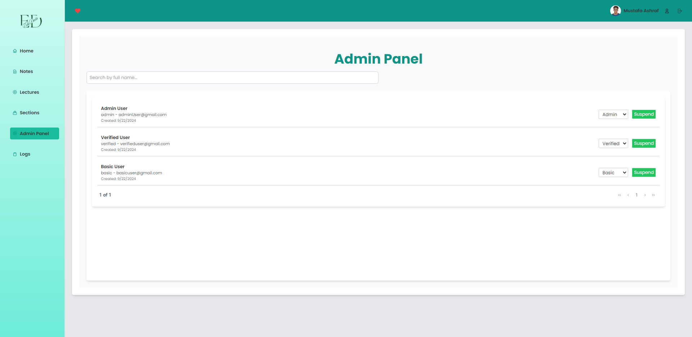

# EduData

EduData is a web application designed for college peers to share their notes, lecture sheets, and section repositories with each other. Users can upload, rate, and favorite notes, access a dashboard with various functionalities, and participate in leaderboards.

## Table of Contents

- [Features](#features)
- [Screenshots](#screenshots)
- [Getting Started](#getting-started)
  - [Installation](#installation)
  - [Usage](#usage)
- [Components](#components)
- [Contributing](#contributing)
- [License](#license)
- [Contact](#contact)

## Features

- **Landing Page**: A welcoming page that includes:

  - About: Information about EduData.
  - Login: Access for registered users.
  - Signup: Registration for new users.

- **Main Application**:

  - **Dashboard**:
    - Leaderboard of the first 100 users who signed up.
    - Top 5 notes rated by users.
    - A to-do list for assignments and projects.
    - Top 5 users who uploaded the most.
  - **Notes**: Upload and manage your notes.
  - **Lectures**: Repository for lecture sheets.
  - **Sections**: Repository for section notes.
  - **Admin Panel**: Manage users and content.
  - **Logs**: View application logs.
  - **Favorites**: Access your favorite notes and materials.
  - **User Settings**: Manage your profile and application preferences.
  - **Logout**: Securely log out of the application.

- **User Interaction**:

  - Upload and share notes with peers.
  - Rate and favorite notes.
  - Access sheets and repositories for lectures and sections.

  ## Technologies Used

EduData is built using modern web technologies to ensure a robust and efficient application. Here's an overview of the main technologies and libraries used:

- **Core Technologies**:

  - TypeScript: For type-safe JavaScript development
  - React: A JavaScript library for building user interfaces
  - Vite: A build tool that provides faster and leaner development experience

- **State Management and Data Fetching**:

  - @tanstack/react-query: For efficient server state management and data fetching
  - @supabase/supabase-js: Supabase client for database operations

- **UI and Styling**:

  - @mui/material: Material-UI components for React
  - styled-components: For component-based styling
  - Tailwind CSS: A utility-first CSS framework
  - Framer Motion: For animations and transitions
  - PrimeReact: UI component library for React
  - react-icons: Popular icon packs as React components

- **Form Handling**:

  - react-hook-form: For efficient form state management and validation

- **Routing**:

  - react-router-dom: For declarative routing in React applications

- **User Experience**:

  - react-hot-toast & react-toastify: For displaying toast notifications
  - react-confetti: For celebratory effects

- **Development Tools**:
  - ESLint: For identifying and fixing problems in JavaScript code
  - Prettier: For code formatting
  - PostCSS & Autoprefixer: For processing CSS

This tech stack ensures a modern, performant, and maintainable web application with a great developer experience.

## Screenshots

<table>
  <tr>
    <td></td>
    <td></td>
    <td></td>
  </tr>
  <tr>
    <td></td>
    <td></td>
    <td></td>
  </tr>
  <tr>
    <td></td>
    <td></td>
    <td></td>
  </tr>
  <tr>
    <td></td>
    <td></td>
    <td></td>
  </tr>
  <tr>
    <td></td>
    <td></td>
    <td></td>
  </tr>
</table>

## Getting Started

### Installation

To set up the project locally:

1. Clone the repository:

   ```bash
   git clone https://github.com/yourusername/EduData.git
   cd EduData
   ```

2. Install dependencies:

   ```bash
   npm install
   ```

3. Start the development server:

   ```bash
   npm run dev
   ```

4. Open your browser and visit `http://localhost:3001` to view the application.

### Usage

1. Sign up or log in to your account.
2. Explore the dashboard to view leaderboards, top notes, and your to-do list.
3. Upload and manage your notes, rate others' notes, and save favorites.
4. Access the lectures and sections repository for additional resources.

## Components

The main components of EduData include:

- **Landing Page**: Introduction to the app with links to about, login, and signup pages.
- **Dashboard**: Overview of the app's highlights, including leaderboards and top content.
- **Notes Management**: Upload, view, and manage notes.
- **Lectures and Sections**: Browse and access lecture sheets and section notes.
- **Admin Panel**: Control panel for managing users and content.
- **User Settings**: Update profile information and preferences.

## Contributing

Contributions are welcome! Please follow these steps:

1. Fork the repository.
2. Create a new branch: `git checkout -b feature/YourFeature`.
3. Make your changes and commit them: `git commit -m 'Add some feature'`.
4. Push to the branch: `git push origin feature/YourFeature`.
5. Open a pull request.

## License

This project is licensed under the MIT License. See the [LICENSE](LICENSE) file for details.

## Contact

For any inquiries or issues, please reach out to:

- **Mustafa Ashraf** - [mustafa.ashraf.saad@gmail.com ](mailto:mustafa.ashraf.saad@gmail.com)

# EduData

EduData is a web application designed for college peers to share their notes, lecture sheets, and section repositories with each other. Users can upload, rate, and favorite notes, access a dashboard with various functionalities, and participate in leaderboards.

## Table of Contents

- [Features](#features)
- [Technologies Used](#technologies-used)
- [Screenshots](#screenshots)
- [Getting Started](#getting-started)
  - [Installation](#installation)
  - [Usage](#usage)
- [Components](#components)
- [Contributing](#contributing)
- [License](#license)
- [Contact](#contact)
